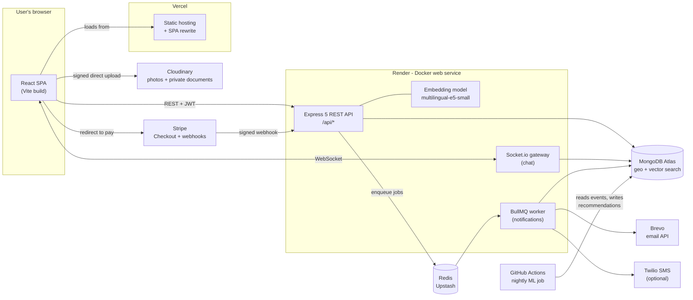
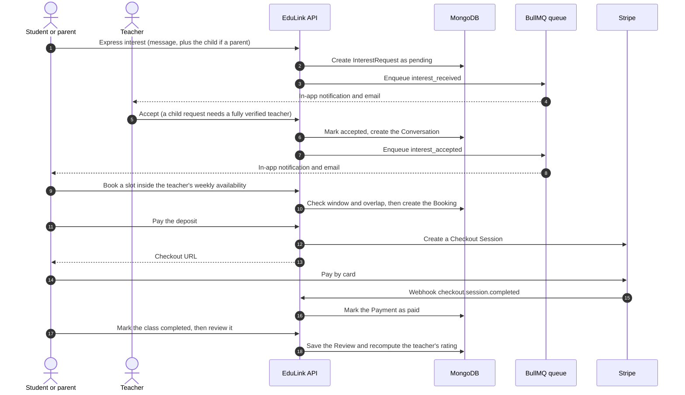
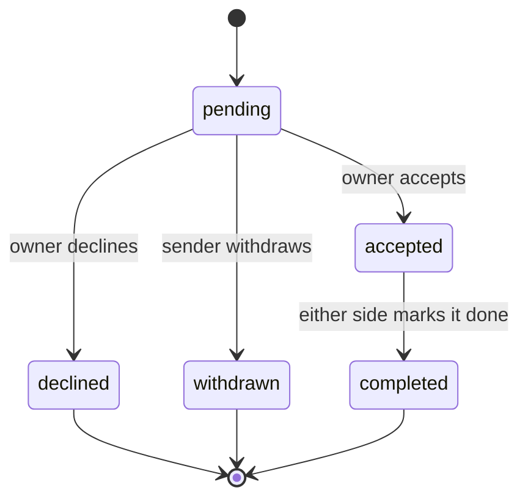

<div align="center">

# EduLink

### Learn from teachers you can trust.

A full-stack marketplace that connects **students and parents in Sri Lanka** with **verified private teachers** — with identity checks, parent-controlled child accounts, private in-app chat, trial-class booking, deposit payments and an admin trust-and-safety console.

[](https://github.com/Vihanga-Deemantha/Edu/actions/workflows/ci.yml)
[](https://github.com/Vihanga-Deemantha/Edu/actions/workflows/ml-nightly.yml)

**[Live app](https://edu-mu-mocha.vercel.app)** · **[Live API](https://eduhub-server.onrender.com)** · [Quick start](#getting-started) · [Feature walkthrough](#feature-walkthrough) · [API reference](#api-reference)

</div>

> **Naming note.** The repository folder is `Eduhub`; the product is branded **EduLink** everywhere a user can see it. A few internal identifiers (the Render service `eduhub-server`, the Stripe line item "EduHub trial class deposit", the seeded admin address) still use the earlier name.

---

## Table of contents

1. [Overview](#overview) — the problem, the solution, who benefits, highlights, live demo
2. [Tech stack](#tech-stack)
3. [Architecture](#architecture)
4. [How it works](#how-it-works) — lifecycle, state machines, trust and safety, search and recommendations
5. [Feature walkthrough](#feature-walkthrough) — every page and feature, role by role
6. [Data model](#data-model)
7. [API reference](#api-reference)
8. [Security and privacy](#security-and-privacy)
9. [Project structure](#project-structure)
10. [Getting started](#getting-started) — run it locally in about ten minutes
11. [Configuration](#configuration) — every environment variable
12. [Testing and CI](#testing-and-ci)
13. [Deployment](#deployment) — the free-tier production setup
14. [Operations and troubleshooting](#operations-and-troubleshooting)
15. [Known limitations and roadmap](#known-limitations-and-roadmap)
16. [Contributing](#contributing)
17. [License](#license)

---

## Overview

### The problem

Private tuition is a major part of education in Sri Lanka — from the Grade 5 Scholarship to O/L and A/L exams, university subjects, languages and music. Yet finding a tutor is still mostly informal: word of mouth, social-media posts and notice boards. That leaves everyone with the same problems:

- **Trust** — a parent has no easy way to check who will be teaching their child.
- **Discovery** — comparing tutors by subject, level, teaching medium (Sinhala / Tamil / English), curriculum (local / Cambridge / Edexcel), distance and price means scrolling through posts and asking around.
- **Privacy** — phone numbers are swapped on first contact, before anyone knows who they are talking to.
- **Reputation** — good teachers cannot carry verified reviews from one family to the next.
- **Logistics** — scheduling, no-shows and deposits are negotiated ad hoc over chat.

### The solution

EduLink moves that whole process into one place and puts safety first:

1. **Teachers prove who they are.** They upload a national ID (or passport) and a selfie holding it, and optionally a police clearance report. An admin reviews the documents and grants a verification tier that appears as a badge.
2. **Teachers publish class ads; students and parents search** by subject, level, medium, curriculum, class type, price and distance — or simply describe what they need in plain words.
3. **Families can post "wanted" ads** that only logged-in teachers can see, so matching teachers can reach out.
4. **Everything starts with an interest request.** Contact details stay private until the other side accepts, and conversations stay inside the platform's chat.
5. **Accepted requests unlock booking.** Pick a slot inside the teacher's published weekly availability, pay a small deposit, attend the trial class, then leave a review.
6. **Admins keep the platform clean** — they review identity documents, triage reports, flag listings, suspend accounts (sessions end immediately) and keep an audit log.

### Who benefits

| Stakeholder | The problem today | What EduLink gives them |
|---|---|---|
| **Students** (school students, university students, adult learners) | Hard to find a tutor who fits their level, language, budget and location — and hard to know who is genuine. | Search by subject, level, medium, curriculum, class type, price and distance, or in plain language. Verified badges, real reviews, personalised recommendations, private chat and trial-class booking. They can also post a "wanted" ad and let matching teachers come to them. |
| **Parents and guardians** | Worry about who is teaching their child and about children chatting with strangers. | Child accounts that can never log in — every message, booking and payment runs through the parent. Only **fully verified** teachers can accept a request that involves a child. Teachers see only a child's first name, grade and learning needs, and the contact details revealed on acceptance are the parent's, never the child's. |
| **Teachers** (independent tutors, school teachers who tutor privately, language and music instructors) | Word-of-mouth growth, no portable reputation, no-shows, awkward fee and phone conversations. | A free profile and unlimited class ads, a verification badge that builds trust, matched student leads from wanted ads, a weekly availability calendar with double-booking protection, deposits that reduce no-shows, verified reviews that stay with them, and a dashboard with views and request counts. |
| **Admins and trust-and-safety staff** | Need to vet identity documents and respond to abuse quickly and defensibly. | A verification queue with a per-document checklist and expiring document links, a report-moderation queue with severity triage, one-click listing flag and restore, user suspension with immediate session and chat revocation, a per-user audit trail and a KPI dashboard. |
| **The wider community** | Private tuition is large but opaque and unregulated. | A safer, more transparent market: verified identities, structured and comparable listings, and a place where good teachers build a verifiable reputation. |
| **Developers and learners** | Few complete, tested, deployable examples of a trust-and-safety marketplace. | A deployed reference with role-based auth and refresh-token rotation, real-time chat, background jobs, payments, geo and semantic search and an offline ML pipeline, backed by 283 automated tests. |

### Feature highlights

- **Verified teachers** — a three-level badge (none, ID verified, fully verified) that only admins can grant.
- **Smart discovery** — filters (subject, level, medium, curriculum, class type, max price, verified-only), "near me" radius search, natural-language semantic search (multilingual embeddings plus MongoDB Atlas Vector Search) and a learned "Recommended" ranking.
- **Two-sided marketplace** — public teacher ads and "wanted" ads from students and parents (visible to teachers only).
- **Safe by design** — contact details only after acceptance, on-platform chat with a contact-sharing nudge, parent-managed child accounts, a fully-verified gate for child requests, report buttons on listings, teacher profiles and chats.
- **Trial classes** — teacher-defined weekly availability, a slot picker, overlap protection and in-app booking management.
- **Deposits** — a flat trial-class deposit through Stripe Checkout, confirmed by a signed webhook.
- **Real-time chat** — Socket.io messaging with optimistic sending, retry, paged history and instant disconnect on suspension.
- **Reviews** — one review per completed engagement; the reviewer's identity stays private.
- **Notifications** — an in-app bell, a notification centre and email, produced by a background queue.
- **Profile photos** — direct-to-Cloudinary uploads for every role, including admins.
- **Admin console** — dashboard, verification queue, reports, users, listings and an audit log.
- **Personalisation** — a content-based recommender blended with a nightly collaborative-filtering model and a learned ranking.
- **Production-minded** — responsive UI (phone to desktop), security headers, rate limits, CI, Docker, deployed on free tiers.

### Terminology

| Term | Meaning |
|---|---|
| **O/L, A/L** | Sri Lanka's Ordinary Level and Advanced Level national exams. |
| **Grade 5 Scholarship** | The national Grade 5 scholarship exam. |
| **NIC** | National Identity Card. |
| **LKR** | Sri Lankan rupee — the currency of every listing price. |
| **Teacher ad** (`teacher_ad`) | A class a teacher offers. Public. |
| **Wanted ad** (`student_ad`) | A class a student or parent is looking for. Visible only to logged-in teachers (and its owner). |
| **Interest** | A request sent from one side to the other about a specific listing. |
| **Engagement** | An interest that has been accepted and then completed — the unit that can be reviewed. |
| **Child account** | A student record created and controlled by a parent. It has no login. |

### Live demo

| | URL |
|---|---|
| Web app (Vercel) | <https://edu-mu-mocha.vercel.app> |
| API (Render) | <https://eduhub-server.onrender.com> |
| Health check | `GET https://eduhub-server.onrender.com/api/listings/browse` |

- Everything runs on **free tiers**. After a quiet period the API host goes to sleep, so the **first request can take up to a minute**; afterwards it is fast.
- Payments are in **Stripe test mode** — use the card `4242 4242 4242 4242` with any future expiry date and any CVC. No real money moves.
- Verification codes are delivered by **email** (Brevo). SMS is not configured on the live demo, so phone verification is unavailable there.

---

## Tech stack

| Layer | Technology |
|---|---|
| **Frontend** | React 19 · Vite 8 · Tailwind CSS 4 · React Router 7 · React Hook Form + Zod 4 · Axios · Socket.io client · react-hot-toast · `@react-oauth/google` · self-hosted Fontsource fonts (Baloo 2, Instrument Sans, Old Standard TT, Plus Jakarta Sans) |
| **Backend** | Node.js 22 · Express 5 · Mongoose 9 · JSON Web Tokens · bcrypt · Helmet · express-rate-limit · express-validator · Socket.io 4 (ES modules throughout) |
| **Database** | MongoDB (Atlas M0 in production) with `2dsphere` geo indexes and Atlas Vector Search |
| **Queue** | BullMQ 6 on Redis (Upstash in production) through ioredis |
| **Search and AI** | `@huggingface/transformers` running `Xenova/multilingual-e5-small` (384-dimension, multilingual) in-process · Atlas `$vectorSearch` with an in-memory cosine-similarity fallback |
| **ML pipeline** | Python 3.11 — `implicit` (ALS), LightGBM, scikit-learn, NumPy, SciPy, PyMongo — run nightly by GitHub Actions |
| **Payments** | Stripe Checkout with signed webhooks (test mode) |
| **Email and SMS** | Brevo HTTP API (preferred) → Nodemailer SMTP → console log · Twilio SMS (optional) → console log |
| **File storage** | Cloudinary — private "authenticated" delivery for identity documents, public delivery for profile photos |
| **Auth** | Email and password, 6-digit OTPs, optional Google Sign-In · short-lived access JWT plus a rotating httpOnly refresh cookie |
| **Testing** | Vitest · Supertest · mongodb-memory-server — 22 test files, 283 tests |
| **CI/CD and hosting** | GitHub Actions · Vercel (frontend) · Render (Docker API) · MongoDB Atlas · Upstash · Brevo · Cloudinary · Stripe |

### Design decisions

- **Monorepo** — `client/`, `server/` and `ml-jobs/` live together so a change that touches UI, API and ML lands in one pull request.
- **Feature-module backend** — every domain follows `routes → validation → controller → service → models`. Controllers stay thin; rules live in services.
- **Tokens in memory, not in storage** — the access token lives only in JavaScript memory; the refresh token lives in an httpOnly cookie. Nothing sensitive sits in `localStorage`.
- **Queue for side effects** — notifications and email run in a BullMQ worker so a request never waits on an email provider.
- **ML stays offline** — Node never calls Python. The nightly job writes cached results to MongoDB; the API treats them as optional inputs, so a stuck or never-run job degrades quality, never availability.
- **Free-tier friendly** — the API and the worker can share one process (`RUN_WORKER_INLINE`), and the embedding model's eager warm-up can be skipped on 512 MB hosts (`SKIP_EMBEDDING_WARMUP`).

---

## Architecture

### System overview



### Components

| Component | Responsibility | Lives in |
|---|---|---|
| **React SPA** | All UI. Keeps the access token in memory, refreshes it transparently when a request returns 401 (one shared in-flight refresh), and talks REST plus WebSocket. | `client/` |
| **Express API** | Authentication, marketplace rules and moderation, behind Helmet, a CORS allow-list, rate limits, validation and a central error handler. | `server/src/app.js` |
| **Socket.io gateway** | Authenticated chat on the same port as the REST API. | `server/src/sockets/chatSocket.js` |
| **BullMQ worker** | Writes in-app notifications and sends email. Runs inside the API process on free hosting, or as its own process. | `server/src/queues/`, `server/src/worker.js` |
| **Embedding service** | Turns listings and search queries into 384-dimension vectors locally — no external AI API. | `server/src/services/embedding.service.js` |
| **ML job** | Nightly ALS and LightGBM training; writes `RecommendationCache` and `RankingConfig`. | `ml-jobs/` |
| **Cloudinary** | The browser uploads files **directly** using parameters the server signs, so files never pass through the API. | `server/src/services/upload.service.js` |
| **Stripe** | Hosted Checkout page; a signed webhook confirms payment. | `server/src/modules/payments/` |

### The core marketplace sequence



### Request pipeline

Every request passes through the same stack, in this order (`server/src/app.js`):

1. `trust proxy` set to 1, so rate limiting sees the real client IP behind the host's reverse proxy.
2. **Helmet** security headers.
3. **CORS** against an allow-list (`CORS_ORIGIN`, comma-separated), with credentials. The same check guards Socket.io.
4. The **Stripe webhook** route, registered *before* the JSON parser because signature verification needs the raw request body.
5. JSON body parsing and cookie parsing.
6. Feature routers under `/api/*`. Each route chains `authenticate` / `optionalAuthenticate` → `authorize(...roles)` → express-validator rules → `validate` → controller.
7. A JSON 404 handler and a central error handler.

Responses use one envelope:

```jsonc
// success
{ "success": true, "data": { /* ... */ } }

// failure (HTTP status mirrors the error)
{ "success": false, "error": { "message": "Human readable", "code": "MACHINE_CODE" } }
```

Validation failures return **422** with code `VALIDATION_ERROR`; duplicate-key conflicts return **409**; unknown routes return **404** `NOT_FOUND`.

### Real-time chat

- The client opens a Socket.io connection to the API origin and authenticates with the same access token REST uses, sent in the handshake `auth` payload. If the token has expired, the client refreshes it once and reconnects.
- On connect, the server joins the socket to a private room for the user and to a room for each of the user's conversations.
- Messages are sent with the `send_message` event and an acknowledgement; the server broadcasts `new_message` to the conversation room. Room membership is only a routing convenience — **participation is re-checked in the database on every message**.
- Message history is loaded over REST (`GET /api/chat/conversations/:id/messages`), 30 messages per page, newest first.
- Suspending a user disconnects all of their live sockets immediately.
- A conversation is created automatically the moment an interest is accepted. It has exactly two participants; for a child-linked side the participant is the **parent**, never the child.

### Background jobs and notifications

When something worth telling a user about happens (an interest is received, accepted, declined, withdrawn or completed, or a teacher receives a new review), the request handler enqueues a job and returns immediately. The worker then:

1. writes an in-app `Notification` document, and
2. best-effort emails the user — for a child-linked account the email goes to the **parent**.

Email failures are logged and never block the in-app record. If Redis is unreachable the API still starts and keeps serving; enqueue errors are caught and logged, and notifications simply aren't produced until Redis is back.

Seven notification types are defined and six are emitted today: the `listing_flagged` type exists, but nothing triggers it yet, and bookings, payments and chat messages do not create notifications.

The web app polls for new notifications every 45 seconds; it does not use WebSockets for them.

---

## How it works

### The end-to-end lifecycle

1. **Sign up** as a student, parent or teacher; verify your email with a 6-digit code; sign in.
2. **Teachers** build a profile and submit identity documents. An admin reviews them and sets the teacher's verification tier.
3. **Teachers publish class ads. Students and parents** can browse, search and get recommendations — or publish a wanted ad.
4. **Express interest** with a short message. Parents choose which child it is for. Only one pending request per listing and sender is allowed.
5. **The owner responds** — accept, or decline with an optional reason. The sender can withdraw while the request is still pending. A request that involves a child can only be accepted by a fully verified teacher.
6. **Acceptance opens the conversation** and reveals contact details (the parent's, for a child). Both sides can chat.
7. **Booking** — the teacher publishes weekly availability; either side of an accepted interest picks a slot inside it. The server checks the window and blocks overlaps.
8. **Deposit** — the student side pays a flat deposit through Stripe Checkout; a signed webhook marks it paid.
9. **The class happens.** Either side marks the booking completed (or cancels it beforehand).
10. **Either side marks the interest completed.** The student side can now leave a 1–5 star review with an optional comment. One review per engagement, and reviews cannot be edited.
11. **Signed-in users can report** a listing or a user. Admins triage, resolve or dismiss, flag listings and suspend accounts — all recorded in the audit log.

### State machines

**Interest request**



| Entity | States | Who moves it |
|---|---|---|
| **Interest request** | `pending` → `accepted` / `declined` / `withdrawn`; `accepted` → `completed` | Owner (accept, decline); sender (withdraw); either side (complete) |
| **Booking** | `confirmed` → `cancelled` / `completed` | Either side |
| **Payment** | `pending` → `paid` (the schema also defines `failed`, but nothing sets it today; abandoned checkouts simply stay `pending`) | Stripe webhook |
| **Listing** | `active` ⇄ `closed` (owner); `active` ⇄ `flagged` (admin — hidden from search) | Owner, admin |
| **Teacher verification** | `not_submitted` → `pending_review` → `approved` / `rejected` (`expired` exists in the schema, but nothing sets it automatically); tier `none` / `id_verified` / `fully_verified` | Teacher submits; admin decides |
| **Report** | `pending` → `resolved` / `dismissed`; severity `low` / `medium` / `high` | Admin |

All interest transitions are **atomic** (a conditional update that only succeeds if the request is still in the expected state), so two simultaneous clicks — an accept racing a decline, for example — can never both win.

### Trust and safety model

#### Verification tiers

| Tier | How it is earned | What it unlocks |
|---|---|---|
| **None** | Default. | The teacher can build a profile and publish ads. Their card reads "Not yet verified", and they earn no verification points in the "Recommended" ranking. |
| **ID verified** (Level 1) | National ID or passport, plus a selfie holding it — approved by an admin. | An "ID verified" badge and half the verification points in the ranking. |
| **Fully verified** (Level 2) | Level 1 plus a police clearance report issued within the last six months — approved by an admin. | A "Fully verified" badge, the ability to **accept requests that involve child accounts**, inclusion in the "Fully verified only" filter, and full verification points in the ranking. |

The tier lives in a private `TeacherVerification` record and is **mirrored** onto the public `TeacherProfile` so that public reads never touch identity data. Teachers cannot set it themselves; only an admin action changes it.

#### Child-safety rules

- A child is a student record created by a parent. It has **no password and cannot log in** (`loginDisabled`).
- Adding a child requires the parent to be **email- and phone-verified** and to **attest** that they are the child's parent or legal guardian.
- The parent acts for the child everywhere: sending interests, responding, chatting, booking, paying and reviewing.
- A request involving a child can only be **accepted by a fully verified teacher**, whichever side sent it.
- Chat participants are the parent and the teacher — the child is never a direct party, and the parent sees every message.
- Contact details revealed on acceptance are the **parent's**; a child's stored email and phone are random placeholders.
- A child's photo and identity are not exposed in summaries; teachers see only the first name, grade and learning needs.
- Notification emails for a child-linked account go to the parent.

#### Privacy rules

- **Contact details** (name, email, phone) appear only after a request is accepted.
- **Messages stay on the platform**; the chat nudges users who type a phone number or email address to keep talking there until a booking is confirmed.
- **Wanted ads** are invisible to anyone who is not a logged-in teacher (or the ad's owner or parent) — the API returns 404, never 403, so their existence is not confirmed.
- **Reviewer identity** is never exposed: public reviews show rating, comment and date only, and reviewers appear as "Verified student".
- **Identity documents** are stored privately and viewed only through links that expire in five minutes, by the owner or an admin.
- **Admin notes** on a verification are never returned to teachers or the public.

### Search, ranking and recommendations

#### Browse and filters

`GET /api/listings/browse` accepts `subject`, `grade`, `medium`, `curriculum`, `classType`, `verifiedOnly`, `minPrice`, `maxPrice`, `lat` + `lng` (+ `radiusKm`), `sort`, `page` and `limit`. Sorting options are `recommended`, `rating`, `price`, `distance` (needs coordinates) and `newest`. Location filtering uses MongoDB `$geoNear` on a `2dsphere` index and returns each listing's `distanceMeters`.

#### Semantic ("describe what you need") search

When the search box contains text, the app calls `POST /api/search/semantic`. The query (for example *"O/L maths tutor near Kandy, weekends only"*) is embedded locally with the multilingual E5 model and matched against listing embeddings:

- The listing's embedding is built from subject, grade and description (plus the teacher's bio for a teacher ad) and regenerated whenever that text changes.
- Structured filters you set (subject, grade, medium, curriculum, class type, price, verified-only) are applied as **hard constraints**, shared with plain browse — the embedding never has to guess at things you stated precisely.
- Ranking uses Atlas `$vectorSearch` (index `listing_embedding_index`). If that is unavailable — a local MongoDB, or no index yet — the server falls back to an in-memory cosine-similarity ranking over up to 200 candidates.
- Embeddings are never returned in API responses.

#### The "Recommended" sort

`sort=recommended` ranks listings with a learned score:

```
score = (avgRating / 5) × wRating  +  min(reviewCount / 20, 1) × wReviews  +  verification × wVerification
        where verification = 1 (fully verified), 0.5 (ID verified), 0 (none)
```

The default weights are 40 / 20 / 40. The nightly ML job replaces them with weights distilled from a LightGBM ranker trained on search → view → interest behaviour; if the job has never run, the defaults apply.

#### Dashboard recommendations

`GET /api/recommendations/teachers` (students and parents) and `GET /api/recommendations/students` (teachers) score up to 200 recent active listings against the viewer's profile with a weighted function (each side sums to 100):

| Factor | Teachers recommended to a student | Wanted ads recommended to a teacher |
|---|---|---|
| Subject match | 30 | 30 |
| Grade match | 20 | 20 |
| Medium match | 10 | 10 |
| Location (linear fall-off to 0 at 50 km; neutral if unknown) | 20 | 20 |
| Price fit (within budget scores full; neutral if unknown) | 15 | 20 |
| Verification tier | 5 | — |

If the user has a fresh collaborative-filtering score (under 7 days old), it is blended in at **40%** (`0.6 × content + 0.4 × CF`). With no cache the content score is used alone, so cold start can never break it. Each recommendation carries a plain-language reason such as *"Recommended because it's the right subject, the right grade, and nearby."*

#### Price suggestion for teachers

While writing an ad, a teacher sees what similar classes charge — the 25th–75th percentile and median for the same subject, grade and medium — shown once at least three comparable ads exist.

#### The offline ML pipeline

`ml-jobs/run.py` is a plain Python script, not a service. A GitHub Actions workflow runs it nightly at 21:30 UTC (03:00 in Sri Lanka). It reads the interaction history (views, interests sent and accepted, reviews) from MongoDB and trains two models:

- **Collaborative filtering** (ALS, `implicit`) — per-user scores written to `RecommendationCache`.
- **Learning to rank** (LightGBM) — distilled into the three weights stored in `RankingConfig`.

Either step skips itself, without failing, when there isn't enough interaction data yet.

---

## Feature walkthrough

### Page map

| Route | Who can open it | Page |
|---|---|---|
| `/` | Everyone | Landing page |
| `/register`, `/login`, `/forgot-password`, `/reset-password`, `/verify-otp`, `/complete-profile` | Guests (and the unfinished states of new accounts) | Authentication |
| `/browse` | Everyone | Browse and search |
| `/listings/:id` | Everyone (wanted ads: teachers and owners only) | Listing detail |
| `/teachers/:userId` | Everyone | Public teacher profile |
| `/dashboard` | Logged-in users (admins are redirected to `/admin`) | Role-specific home |
| `/profile/edit` | Teacher, student, parent | Edit profile |
| `/verification` | Teacher | Identity verification |
| `/listings/new`, `/listings/:id/edit`, `/listings/mine` | Teacher, student, parent | Ad editor and "my ads" |
| `/interests` | Teacher, student, parent | Interest inbox (Received / Sent) |
| `/chat`, `/chat/:conversationId` | Logged-in users | Messages |
| `/availability` | Teacher | Weekly availability editor |
| `/bookings`, `/bookings/:bookingId` | Teacher, student, parent | Bookings and payments |
| `/children` | Parent | Child accounts |
| `/notifications` | Logged-in users | Notification centre |
| `/admin`, `/admin/verification`, `/admin/reports`, `/admin/users`, `/admin/listings`, `/admin/profile` | Admin | Admin console |

A route guard sends visitors to the right place: signed-out users go to `/login` (and return afterwards), users with an unfinished email check go to `/verify-otp`, new Google users go to `/complete-profile`, and users who open a page their role cannot use land on `/dashboard`.

### Visitors (guests)

- **Landing page (`/`)** — three audience-specific hero scenes (student, parent, teacher) with a search box (*"What do you want to learn? e.g. A/L Physics"*), a trust strip, subject tiles, a live **"Classes to explore this term"** rail fed by the API, a "How it works" section, a "Why EduLink" section, **real learner feedback** (the latest written reviews) and a call to action for teachers.
- **Browse (`/browse`)** — fully usable without an account. See [Browse and search](#browse-and-search) below.
- **Listing detail and teacher profiles** — readable without signing in. When a guest tries to express interest they are sent to sign in and returned to the same page afterwards.
- **Header search** — the search box in the top bar sends you to `/browse?q=…` from anywhere.

### Accounts and sign-in

| Step | What happens |
|---|---|
| **Register** (`/register`) | Choose **Student**, **Parent** or **Teacher** — the role cannot be changed later. Enter name, email, a Sri Lankan mobile number (`+94XXXXXXXXX` or `0XXXXXXXXX`) and a password of at least 8 characters. |
| **Verify** (`/verify-otp`) | A 6-digit code is emailed to you. Codes expire after 10 minutes, can be re-sent after a 60-second cooldown, and lock after 5 wrong attempts. Phone verification by SMS is optional ("now or later") when an SMS provider is configured. |
| **Sign in** (`/login`) | Email and password. A verified **email** is required (a verified phone is not). An unverified account is routed back to the verification step. |
| **Google Sign-In** *(optional, feature-flagged)* | One click. First-time Google users finish on `/complete-profile` by choosing a role and adding a mobile number. |
| **Forgot password** (`/forgot-password` → `/reset-password`) | Enter your email, receive a 6-digit code, choose a new password. |
| **Sessions** | Staying signed in is automatic: the access token (15 minutes) is refreshed silently from a 7-day httpOnly cookie. Signing out revokes the refresh token. |
| **Suspension** | A suspended account cannot sign in, and its sessions and open chats end immediately. |

Admin accounts cannot be self-registered; they are created only by the [seed script](#getting-started).

### Browse and search

Open `/browse`. The whole state lives in the URL, so every search is **shareable** and back/forward work.

- **Search box** — describe what you need in plain words; results are matched by meaning (semantic search). Clear it to return to filter-based browsing.
- **Filters** — subject, level (Grade 1–5, Grade 5 Scholarship, Grade 6–9, Grade 10–11 O/L, A/L, University, Adult learners), medium (Sinhala, Tamil, English), curriculum (Local, Cambridge, Edexcel), class type (one-to-one, group, online, home visits), **Fully verified only**, and a **max price** slider (LKR 1,000–10,000; at the maximum the filter is off).
- **Near me** — uses the browser's location and a radius of 5, 10, 25 or 50 km; results show how far away each listing is.
- **Sort** — Recommended, Highest rated, Lowest price, Nearest, Newest (hidden while a text search is active, because relevance decides the order).
- **Filter chips** — each active filter appears as a removable chip; **Reset all** clears everything.
- **Results** — 12 per page with pagination, skeleton loaders, and friendly empty and error states. When nothing matches, the page suggests clearing filters or posting a wanted ad.
- **What each card shows** — the teacher's photo, name, verification badge ("Not yet verified" otherwise), rating and review count, subject and level, medium and curriculum tags, first schedule slot, price and distance. A teacher viewing the page also sees students' wanted ads, and the page title changes to *"Browse classes and student requests"*.

### Listing detail

`/listings/:id` shows everything about a class:

- Subject, level, medium and curriculum tags, rating, and when it was posted.
- The teacher's card with their photo, verification badge, headline qualification and years of experience, linking to their full profile.
- The description (long text is split into paragraphs) and facts for schedule, class type and level.
- **Weekly availability** — a read-only week grid in the viewer's local time.
- **Where classes happen** — a link that opens an *approximate* area (coordinates rounded to two decimals, roughly 1 km) in Google Maps.
- **Reviews** — the average rating, the review count and the latest reviews, five at a time with a **Show more reviews** button.
- A sticky **action card**: the price (or "Fee on request"), then — depending on who is looking — **Express interest**, "Sign in to express interest", "Interest sent" with a link to Interests, "Interest accepted" with a link to the chat, or "This is your listing" with an **Edit** button. A **Report listing** link sits underneath.
- A closed or flagged listing is hidden from everyone except its owner (or the owner's parent) and admins.

### Public teacher profile

`/teachers/:userId` is what families read before reaching out:

- Photo, name, rating, years teaching and "On EduLink since …".
- Tags for every subject, level, medium, curriculum and class type.
- A **verification banner** that explains in plain language what the badge means — for example, that a fully verified teacher's national ID, selfie with ID and police clearance report were checked and that they can accept requests for children.
- Section tabs — **About**, **Classes**, **Availability**, **Reviews** — with a bio, qualifications, active class cards, a weekly availability grid and the review list.
- **Express interest** (choose which of the teacher's classes it is for), and **Report this teacher**.

### Expressing interest

The **Express interest** dialog works the same everywhere it appears:

- A parent must choose **which child** the request is for (preselected if they have only one).
- Write a message of at least 10 characters (up to 1,000); one-tap starters are offered (*"I'm preparing for my exams"*, *"Looking for weekend classes"*, *"Could we start with a trial class?"*; teachers get teacher-appropriate starters).
- Sending is free. A confirmation explains what happens next.
- The server blocks interest in your own listing, a second pending request for the same listing, and any listing that is closed, flagged or not visible to you.

### Students

**Home (`/dashboard`)**

- A **Find a new teacher** call to action and, until the profile is complete, a nudge to finish it for better matches.
- **Next class** — the upcoming booking with **Pay deposit** and **Details** buttons, or a prompt to book from an accepted interest.
- **Messages** — the latest conversations.
- **Recommended for you** — teacher cards based on your grade, subjects and location, with a "why this match" line.
- **Your interests** — your requests with status filters.
- **This week** — bookings at a glance — plus a **Post a wanted ad** card.

**Profile (`/profile/edit`)** — photo upload; learning preferences (level, subjects, preferred medium); location (a "use my current location" pin plus district and town); and sign-in details (email and phone are read-only — contact support to change them; **Reset password** links to the reset flow). A profile-strength meter and a live "unsaved changes" bar help you finish.

**Wanted ads (`/listings/new`)** — a guided editor with a live preview and a "Ready to publish" checklist:

1. **What you need** — subject, level, medium and an optional curriculum.
2. **Where** — optionally add your location with **Use my current location** (your browser asks permission); only an approximate area is shown publicly.
3. **When** — tap the times that suit you on a weekly grid.
4. **Budget** — an optional amount in LKR per hour or per month.
5. **Description** — 10 to 2,000 characters, with optional Sinhala and Tamil translations.

Manage ads at `/listings/mine`; see [My listings](#my-listings-all-ad-owners).

**Interests (`/interests`)** — see [The interest inbox](#the-interest-inbox) below.

**Bookings (`/bookings`)** — see [Bookings and payments](#bookings-and-payments).

### Parents and child accounts

Parents get everything students get, plus child management.

**Add a child (`/children`)**

- Enter the child's **first name**, an optional **grade**, and tick the guardianship attestation (*"I'm this child's parent or legal guardian and I'll supervise their use of EduLink"*).
- Your own email **and** phone must be verified first.
- Each child gets a **learning profile** — level, subjects and medium — used to recommend teachers.

**The Children page** gives each child a card with their teachers, any **deposit due** (with a **Pay deposit** button), message and booking shortcuts, a recent-activity feed, and a "coming up" list. A **How child safety works** panel states the four promises: only fully verified teachers, messages come to you, contact details stay private, and every booking and payment is yours.

**Parent home** — upcoming classes for all children, recommended teachers for the selected child, a children panel, deposits paid with a link to payment history, and a note that you see every message.

**Acting for a child** — wherever a child is involved (posting a wanted ad, expressing interest, editing a profile) a **"Who is this for?"** selector appears. The profile editor has an *"Editing profile for…"* switcher, and a separate "Your profile photo" for the parent's own picture.

### Teachers

**Home (`/dashboard`)**

- **Update availability** and **Post a class ad** shortcuts, and a prompt to build a profile if none exists.
- **Interest requests** — accept or decline right from the dashboard (with a clear explanation when a child request needs full verification).
- **Your ads** — views over the last 30 days and request counts per ad.
- **Students looking for a teacher** — wanted ads that match your subjects and levels.
- **This week** — your booked classes — plus a **verification status** card with a next step.

**Profile (`/profile/edit`)**

- *Basic information* — photo, name (taken from your account), an optional intro-video link, and district and town with a location pin.
- *About and teaching* — bio (up to 1,000 characters, with optional Sinhala and Tamil versions), subjects, levels, teaching medium, curriculum, **how you teach** (individual, group, online, home visit), qualifications (one line each, e.g. *"BSc (Hons) Physics, University of Peradeniya, 2015"*) and years of experience.
- A **verification card** and a **profile-strength** meter.

**Verification (`/verification`)**

| Document | Needed for |
|---|---|
| **National ID or passport** (both sides, all corners visible) | Level 1 |
| **Selfie holding your ID** | Level 1 |
| **Police clearance report** (issued by Sri Lanka Police in the last six months) | Level 2 |

Upload each file (JPG, PNG or PDF, up to 10 MB), enter your NIC or passport number, add the police-report issue date if you uploaded one, tick the *"these documents are genuine"* confirmation and submit. A **review timeline** shows progress; reviews usually take one to two working days. If a submission is rejected you see a general explanation of the usual causes (a blurry photo, a name that doesn't match your account, a police report older than six months), any badge you already hold stays active, and you can resubmit. Documents go straight to private storage, are never shown on your profile, and are visible only to EduLink reviewers through links that expire in minutes. If direct upload is not configured, you can paste a link to each document instead.

**Class ads (`/listings/new`)** — a five-step editor with a live preview and publish checklist: what you teach, where, when (a weekly grid), price (LKR per hour or per month, with the **price suggestion** shown beside it) and a description with optional Sinhala/Tamil versions. A banner explains your verification tier and what it means for your ad.

**Availability (`/availability`)**

- A weekly grid in **your local time** — drag across it to add open windows.
- Shortcuts: **Weekday evenings**, **Weekends**, **Copy this day to all weekdays**, **Clear all**.
- A legend separates *Available*, *Booked this week* and *Not available*, with open-hours and booked-hours totals.
- Windows are stored in UTC (see [Known limitations](#known-limitations-and-roadmap)); a window that would cross midnight UTC cannot be saved and you are told which hours to trim.
- A banner reminds you that students can book 30 minutes to 2 hours inside these windows and that double-booking is blocked automatically.

**The interest inbox, bookings and chat** work as described in the sections below.

### The interest inbox

`/interests` has **Received** and **Sent** tabs, with a badge for pending received requests and status filters (All, Pending, Accepted, Completed, Declined, Withdrawn) that show counts.

A master–detail layout lists requests on the left. Selecting one shows:

- The other party (parents see *"For child · …"* tags), the listing it concerns (linking back to it), the message, and when it was sent.
- **Actions for the receiving side while pending** — **Accept**, or **Decline** with an optional reason chosen from presets (*"Not available at this time"*, *"Doesn't match what I'm looking for"*, *"Already found a good fit"*, *"Location doesn't work"*) plus a free-text note. If the teacher is not fully verified and a child is involved, Accept is disabled with the explanation *"Only fully verified teachers can accept requests for child accounts"* and a link to add a police clearance.
- **Actions for the sending side while pending** — **Withdraw request**.
- **Once accepted** — the other side's **contact details** (the parent's for a child), **Open chat**, **Book a trial class**, and **Mark completed**.
- **Once declined** — the reason given and a **Find similar teachers** shortcut.
- **Once completed** — a **review form** for the student side: a star rating and a comment. The note under it explains that only "Verified student" is shown and that reviews cannot be edited later.
- A **history** timeline (sent, accepted/declined/withdrawn, completed, review left).

### Chat

`/chat` is a two-pane messenger (a list of conversations and the open thread, plus an "About this chat" panel on wide screens).

- **Conversation list** — newest activity first, with a last-message preview and a search box.
- **Thread** — day separators (Today, Yesterday, …), your messages on one side and theirs on the other, **older messages loaded on demand**, and a header linking to the other person's profile.
- **Sending** — press <kbd>Enter</kbd> to send, <kbd>Shift</kbd>+<kbd>Enter</kbd> for a new line (messages up to 2,000 characters). Messages appear instantly; if delivery fails they are marked and can be retried.
- **Quick replies** — one-tap suggestions such as *"When are you free?"* and *"Can we book a trial class?"*.
- **Safety nudge** — if you type something that looks like a phone number or email address, a banner reminds you to keep chatting on EduLink until a booking is confirmed.
- **Context card** — *Ready to start?* with shortcuts to book from Interests or open **My bookings**.
- **Report** — report the conversation partner from inside the chat.
- A parent sees their own conversations *and* the conversations of their linked children.

### Bookings and payments

**Booking a trial class**

1. From **Interests** (accepted request), **Chat** or **Bookings → + Book a class**, choose the accepted request.
2. The **Book a trial class** dialog offers only valid choices: dates within the next 21 days on which the teacher has availability, start times every 30 minutes, and durations of 30, 60, 90 or 120 minutes. Slots less than an hour away are not offered. Everything is shown in your local time.
3. Add optional notes (up to 500 characters) and confirm. The server re-checks that the slot sits fully inside a published window and does not overlap another confirmed booking; if two people grab the same slot at the same moment, exactly one wins.

**Managing bookings (`/bookings`)**

- Tabs: **Upcoming**, **Past**, **Cancelled**, **Payments**.
- Each booking card shows the date block, time range, the other party (for teachers: *"Child account"* when relevant), notes, and badges for booking status and — on the student side — **Deposit paid / unpaid**. Classes starting within 48 hours are labelled *Tomorrow* or *Within 24 hours*.
- Actions: **Pay deposit**, **Message**, **Mark completed** (after the class has ended), **Cancel** (with a confirmation dialog that notes the other side is affected), **Leave a review** and **Book again**.
- The **Payments** tab summarises deposits paid, paid bookings and **deposits due now**, with a table of every deposit.

**The deposit**

- Only the **student side** of a confirmed booking pays. The amount is a **flat fee** set by the server (`TRIAL_DEPOSIT_AMOUNT_CENTS`, default 1000 = US$10.00). It is deliberately not derived from the lesson's LKR price — Stripe does not support Sri Lanka as an account country, so this is a separate flat reservation fee, not a currency conversion.
- **Pay deposit** redirects to Stripe's hosted Checkout page. On return the page shows *Payment successful* (or *Payment wasn't completed — no money was taken*) and re-fetches the booking, so the badge reflects the **webhook's** result rather than the redirect.
- A paid deposit cannot be paid twice, and the webhook is idempotent — a retried delivery is a no-op.
- Cancelling a paid booking shows a note to contact support about refunding the deposit; refunds are not automated.

### My listings (all ad owners)

`/listings/mine` lists your ads with status filters (**All open**, **Active**, **Under review**, **Closed**) and sorting (**Recently updated**, **Most interest**, **Most views**). A summary strip shows active ads, **views in the last 30 days**, **interest requests** and **requests per view**. Each ad has **Edit**, **Review requests**, **Close** (hides it from search; existing chats are unaffected) and **Reopen ad**. A flagged ad shows a banner explaining that it is hidden until an admin restores it. Parents see their children's wanted ads here too.

### Reviews

- Only the student side of a **completed** engagement can review — a parent reviews on behalf of their child.
- Rating is 1–5 stars; the comment is optional (up to 1,000 characters). **One review per engagement**, enforced by a unique database constraint, and reviews are immutable.
- The teacher's average rating and review count are **recomputed from all reviews** on every new review, so they cannot drift.
- Public reviews show rating, comment and date only. The landing page features the latest written reviews.
- Reports about reviews are supported by the API and the admin queue; a report button on individual reviews is not in the web app yet.

### Notifications

- **Bell** in the header with an unread badge and a dropdown of the latest items, refreshed every 45 seconds.
- **Notification centre (`/notifications`)** — grouped by day (Today, Yesterday, Earlier this week, Older), filtered by category (All, Interests, Reviews, Listings) and by unread, with **Mark all as read**, an **Also by email** explainer, and a context action on each item (*Review request*, *Open interests*, *Leave a review*, *See your reviews*, *View listing*).
- Seven notification types are defined — interest received, accepted, declined, completed and withdrawn; new review; listing flagged — and the first six are emitted today. A parent sees their own notifications and those of their linked children.

### Reporting

Signed-in users can report a **listing** (from the listing page) or a **user** (from a teacher's profile or from a chat). The dialog offers preset reasons per type — for example *"Asks to pay outside EduLink"*, *"Inappropriate messages"*, *"Suspected fake account"* — plus free text (up to 1,000 characters). Severity is **never** set by the reporter; admins triage it. The API and the admin queue also support reports about individual reviews.

### Admins

The admin console (`/admin`) has its own sidebar layout with live queue counts, and a link back to the marketplace.

**Dashboard** — headline numbers (students and parents, **verified teachers** as a "trust score" gauge, bookings this month, deposits this month), monthly charts for bookings, deposits and reports, upcoming confirmed bookings and completion rate, **average review time** and **rejection rate** for verifications, and "needs action" queues for pending verifications, flagged listings and open reports, plus recent verifications and open reports.

**Verification queue (`/admin/verification`)**

- A filterable queue with submission details: NIC or passport number, current tier, police-report issue date, qualifications.
- Each document opens through a **short-lived signed link**; a **checklist** (name matches profile and ID, selfie matches the ID photo, police report issued in the last six months) is completed as you open them, and **Approve** stays disabled until every document has been opened.
- **Approve** sets the tier explicitly — for example ID verified without granting fully verified. **Reject** requires a reason (presets such as *"Document unclear"*, *"Police report too old"*, *"Selfie doesn't match ID"*, or your own text), which is kept in the internal review record — teachers are never shown admin notes, only a general explanation. Rejecting leaves any tier the teacher already holds in place.

**Reports (`/admin/reports`)**

- A queue that lists **pending reports highest severity first**, with filters for status and severity and a text search.
- Each report shows the reporter and an **inline summary of what was reported** (the review text, the listing, or the user), plus **Open listing / Open profile** links.
- Actions depend on what was reported — for a listing: **Flag listing and resolve**, **Resolve without action** or **Dismiss**; for a user: **Resolve (warned)**, **Suspend account and resolve** or **Dismiss**; for a review: **Mark resolved** or **Dismiss**. You can also change a report's **severity**. Suspending requires a note; other decisions accept an optional one. Every decision is written to the audit log.

**Users (`/admin/users`)** — filter by role (with counts) and by status, search, see verification state and join date, **Suspend** (a reason is required) or **Unsuspend**, and open a per-account **audit trail** of every admin action. Suspension signs the user out everywhere immediately, including any open chat, and blocks sign-in until reactivated. Admin accounts cannot be suspended.

**Listings (`/admin/listings`)** — browse listings with status chips and counts (**Flagged** is the default view, then Active, Closed and All) and a search box, **Flag and hide** or **Restore** with an optional audit note, and open a listing in the marketplace. The owner sees a banner on a flagged ad in *My listings*.

**Profile (`/admin/profile`)** — the admin's own name and profile photo, shown in the console header.

### Platform-wide features

- **Responsive design** — layouts adapt from phone to desktop, with a slide-in navigation drawer on small screens.
- **Role-aware navigation** — the header, account menu and footer change with the signed-in role.
- **Profile photos** — every role (teacher, student, parent, admin) can upload, change and remove a photo (JPG, PNG or WEBP, up to 10 MB). Teachers' and students' photos live on their profile; parents' and admins' live on the account. Photos appear across the app — the header, listing cards, interests, bookings and profiles.
- **Loading, empty and error states** — skeleton loaders, friendly empty states and retry actions throughout.
- **Accessibility groundwork** — semantic roles and ARIA state on tabs, toggles and dialogs, keyboard-operable controls, and a reduced-motion hook.
- **Language** — the interface is English. A Sinhala/Tamil string dictionary and a language-switcher component are kept in the code base for a future release (currently disabled), and listings and teacher bios can already store optional Sinhala and Tamil translations.
- **Event logging** — views, searches and interest events are recorded (and expire after 180 days) to feed the recommenders and the owner-facing view counts.

---

## Data model

MongoDB, through Mongoose. Twenty collections:

<details>
<summary><b>Show the collections and their key fields</b></summary>

| Collection | Purpose | Key fields and rules |
|---|---|---|
| `User` | Every account: teacher, student, parent, admin. A **child** is a `student` with a `parentId`. | `name`, `email` (unique), `phone` (unique, Sri Lankan format), `passwordHash` (hidden by default), `role`, `emailVerified`, `phoneVerified`, `authProvider` (`local`/`google`), `googleId` (sparse unique), `profileComplete`, `isActive`, `photoUrl`, `loginDisabled`, `parentId`, `linkedChildIds[]`, `attestedAt` |
| `TeacherProfile` | The public teacher profile. | `subjects[]`, `grades[]`, `medium[]`, `curriculum[]`, `classType[]`, `bio` (+ optional `bio_si`, `bio_ta`), `qualifications[]`, `experienceYears`, `location` (GeoJSON Point), `district`, `town`, `photoUrl`, `introVideoUrl`, `verificationStatus` (mirror), `avgRating`, `reviewCount`. Indexes: `2dsphere` on `location`; `subjects`; `grades`. |
| `StudentProfile` | A student's or child's learning profile. | `gradeOrLevel`, `subjectsInterested[]`, `medium[]`, `location`, `district`, `town`, `photoUrl` |
| `TeacherVerification` | **Private** identity records, one per teacher, never joined into public reads. | `nicNumber`, `nicDocumentUrl`, `selfieWithIdUrl`, `qualificationDocuments[]`, `policeClearanceUrl` / `IssuedAt` / `ExpiresAt`, `references[]`, `verificationTier`, `status`, `adminReviewerId`, `adminNotes` (hidden by default), `submittedAt`, `reviewedAt` |
| `Listing` | Marketplace inventory. | `type` (`teacher_ad`/`student_ad`, immutable), `ownerId` (a child's id for a child's ad), `subject`, `grade`, `medium`, `curriculum`, `price {amount, currency, unit}`, `schedule[]`, `description` (+ `_si`, `_ta`), `location`, `status` (`active`/`closed`/`flagged`), `embedding` (384 floats, hidden by default). Indexes: `2dsphere`; `(type, status, subject, grade)`; `ownerId`. |
| `InterestRequest` | A request about a listing. | `listingId`, `fromUserId`, `toUserId`, `message`, `status`, `declineReason`, `respondedAt`. A **partial unique index** allows only one pending request per listing and sender. |
| `Conversation` | One chat per accepted interest. | `interestRequestId` (unique), `participantIds` (exactly two account holders), `lastMessageAt` |
| `Message` | Chat messages. | `conversationId`, `senderId`, `text` (≤ 2,000). Index on `(conversationId, createdAt)`. |
| `TeacherAvailability` | Recurring weekly windows. | `teacherId`, `dayOfWeek` (0–6), `startTime` / `endTime` (`HH:mm`, UTC) |
| `Booking` | A scheduled trial class. | `interestRequestId`, `teacherId`, `studentId`, `startTime`, `endTime`, `status` (`confirmed`/`cancelled`/`completed`), `notes` (≤ 500) |
| `Payment` | A Stripe Checkout deposit. | `bookingId`, `payerId`, `amount` (cents), `currency`, `stripeSessionId` (unique), `status`, `paidAt` |
| `Review` | A rating of a teacher. | `teacherId`, `reviewerId`, `rating` (1–5), `comment` (≤ 1,000), `linkedRequestId` (unique) |
| `Report` | A moderation report. | `reporterId`, `targetType` (`review`/`listing`/`user`), `targetId`, `reason` (≤ 1,000), `status`, `severity` |
| `Notification` | In-app notifications. | `userId`, `type` (seven values), `payload`, `read` |
| `AuditLog` | Every admin action. | `adminId`, `action`, `targetType`, `targetId`, `metadata` |
| `Event` | Behaviour log for recommendations and view counts. | `userId` or `sessionId`, `action` (`view_listing`, `view_profile`, `search`, `filter_apply`, `interest_sent`, `interest_accepted`), `targetType`, `targetId`, `metadata`. **TTL: 180 days.** |
| `OtpCode` | One-time codes, stored hashed. | channel (`email`/`phone`), purpose (`signup`/`login`/`password_reset`), attempts. **TTL on expiry.** |
| `RefreshToken` | Refresh tokens, stored hashed. | hashed token, `jti`, rotation state. **TTL on expiry.** |
| `RecommendationCache` | Per-user collaborative-filtering scores (written by the ML job). | `userId`, `recommendations[]`, `computedAt` |
| `RankingConfig` | The learned ranking weights (a single document, `listing_ranking`). | `rating`, `reviewCount`, `verification` weights |

</details>

---

## API reference

**Base URL** — `http://localhost:5067/api` locally, `https://eduhub-server.onrender.com/api` in production.

**Conventions**

- **Authentication** — `Authorization: Bearer <access token>`. The refresh token travels in an httpOnly `refreshToken` cookie, so cross-origin clients must send credentials.
- **Access column** — *Public*: no token. *Optional*: works for guests but returns more when signed in. *Auth*: any signed-in user. Otherwise the allowed role(s).
- **Pagination** — `page` (from 1) and `limit` (up to 50); responses include `pagination: { page, limit, total }`.
- **Envelope and errors** — see [Request pipeline](#request-pipeline).
- **Rate limits** (per IP, per 15 minutes) — register and login: 10; resend-OTP and forgot-password: 3; verify-OTP and reset-password: 20.

<details>
<summary><b>Auth</b> — <code>/api/auth</code></summary>

| Method | Path | Access | Purpose |
|---|---|---|---|
| POST | `/register` | Public (limited) | Create a student, parent or teacher account and send a verification code. Body: `name`, `email`, `phone`, `password`, `role`. |
| POST | `/login` | Public (limited) | Email and password → access token plus refresh cookie. Requires a verified email. |
| POST | `/verify-otp` | Public (limited) | Verify an email or phone code. Body: `userId`, `channel`, `code`. |
| POST | `/resend-otp` | Public (limited) | Send a fresh code. Body: `userId`, `channel`. |
| POST | `/refresh` | Refresh cookie | Rotate the refresh token and return a new access token. |
| POST | `/forgot-password` | Public (limited) | Email a password-reset code. |
| POST | `/reset-password` | Public (limited) | Set a new password using the code. |
| POST | `/google` | Public (feature flag) | Sign in with a Google ID token. Only registered when `GOOGLE_SIGNIN_ENABLED=true`. |
| PATCH | `/complete-profile` | Auth | Google users choose a role and add a phone number. |
| POST | `/register-child` | Parent | Add a child account (needs guardian attestation and a verified parent). |
| POST | `/logout` | Auth | Revoke the refresh token and clear the cookie. |
| GET | `/me` | Auth | The current user, including linked children. |

</details>

<details>
<summary><b>Profiles</b> — <code>/api/profiles</code></summary>

| Method | Path | Access | Purpose |
|---|---|---|---|
| PUT | `/teacher` | Teacher | Create or update the teacher profile. |
| GET | `/teacher/:userId` | Optional | Public teacher profile (verification shown as a badge only). |
| PUT | `/student` | Student, parent | Create or update a student's or child's profile (a parent names the child). |
| GET | `/student/:userId` | Teacher, student, parent | Read a student profile (children's data is minimised). |
| GET | `/photo/upload-signature` | Auth | Signed parameters for a direct Cloudinary profile-photo upload. |
| PUT | `/me/photo` | Parent, admin | Set or remove the account photo. |

</details>

<details>
<summary><b>Verification</b> — <code>/api/verification</code></summary>

| Method | Path | Access | Purpose |
|---|---|---|---|
| POST | `/teacher/submit` | Teacher | Submit identity documents for review. |
| GET | `/teacher/me` | Teacher | Your submission status (never includes admin notes). |
| GET | `/teacher/upload-signature` | Teacher | Signed parameters for a private Cloudinary document upload. |
| GET | `/document/:userId/:field` | Owner or admin | A signed link to one document, valid for 5 minutes. |

</details>

<details>
<summary><b>Listings, search and recommendations</b> — <code>/api/listings</code>, <code>/api/search</code>, <code>/api/recommendations</code></summary>

| Method | Path | Access | Purpose |
|---|---|---|---|
| POST | `/listings` | Teacher, student, parent | Create an ad (a parent names the child for a wanted ad). |
| GET | `/listings/mine` | Auth | Your ads with 30-day view and interest stats. |
| GET | `/listings/browse` | Optional | Filtered, sorted, paginated search. See [Browse and filters](#browse-and-filters). |
| GET | `/listings/price-suggestion` | Teacher | Percentile price guidance for a subject, grade and medium. |
| GET | `/listings/:id` | Optional | One listing (wanted ads return 404 unless you may see them). |
| PATCH | `/listings/:id` | Owner or parent | Edit an ad. |
| DELETE | `/listings/:id` | Owner or parent | Close an ad (soft close — it can be reopened with PATCH). |
| POST | `/search/semantic` | Optional | Natural-language search. Body: `query` (≤ 500 chars) plus the same structured filters as browse. |
| GET | `/recommendations/teachers` | Student, parent | Recommended teacher ads (a parent passes `targetUserId`). |
| GET | `/recommendations/students` | Teacher | Recommended wanted ads. |

</details>

<details>
<summary><b>Interests, chat, availability, bookings and payments</b></summary>

| Method | Path | Access | Purpose |
|---|---|---|---|
| POST | `/interests` | Teacher, student, parent | Express interest. Body: `listingId`, `message`, `targetUserId` (parents only). |
| GET | `/interests/sent` | Auth | Requests you (or your children) sent. |
| GET | `/interests/received` | Auth | Requests you received. |
| PATCH | `/interests/:id/respond` | Receiving side | Accept or decline (`status`, optional `declineReason`). |
| PATCH | `/interests/:id/withdraw` | Sending side | Withdraw a pending request. |
| PATCH | `/interests/:id/complete` | Either side | Mark an accepted request completed. |
| GET | `/chat/conversations` | Auth | Your conversations (and your children's). |
| GET | `/chat/conversations/:id/messages` | Participant | Paged message history. |
| POST | `/availability` | Teacher | Add a weekly window (`dayOfWeek`, `startTime`, `endTime` in UTC). |
| GET | `/availability/:teacherId` | Public | A teacher's windows. |
| DELETE | `/availability/:id` | Teacher | Remove a window. |
| POST | `/bookings` | Either side of an accepted interest | Book a slot (`interestRequestId`, `startTime`, `durationMinutes` 15–240, `notes`). |
| GET | `/bookings/mine` | Auth | Your bookings, with parties, listing and payment status. |
| PATCH | `/bookings/:id/cancel` | Either side | Cancel a confirmed booking. |
| PATCH | `/bookings/:id/complete` | Either side | Mark a confirmed booking completed. |
| POST | `/payments/checkout` | Student side | Create a Stripe Checkout Session for the deposit; returns `checkoutUrl`. |
| GET | `/payments/booking/:bookingId` | Either side | The latest payment for a booking. |
| POST | `/payments/webhook` | Stripe signature | Receives `checkout.session.completed` (raw body, signature-verified). |

Chat **messages are sent over Socket.io** (`send_message`), not REST.

</details>

<details>
<summary><b>Reviews, reports and notifications</b></summary>

| Method | Path | Access | Purpose |
|---|---|---|---|
| POST | `/reviews` | Student side of a completed interest | Create a review (`linkedRequestId`, `rating`, `comment`). |
| GET | `/reviews/featured` | Public | The latest written reviews (landing page). |
| GET | `/reviews/teacher/:teacherId` | Public | A teacher's reviews (rating, comment, date). |
| POST | `/reports` | Auth | Report a `review`, `listing` or `user`. Body: `targetType`, `targetId`, `reason`. |
| GET | `/notifications` | Auth | Paged notifications plus `unreadCount`. |
| PATCH | `/notifications/read-all` | Auth | Mark everything read. |
| PATCH | `/notifications/:id/read` | Auth | Mark one read. |

</details>

<details>
<summary><b>Admin</b> — <code>/api/admin</code> (admin only)</summary>

| Method | Path | Purpose |
|---|---|---|
| GET | `/stats` | Dashboard figures and monthly series. |
| GET | `/verifications` | The verification queue. |
| GET | `/verifications/:userId` | One submission in full. |
| PATCH | `/verification/:userId` | Approve or reject at an explicit tier (`verificationTier`, `status`, `adminNotes`). |
| GET | `/users` | Search and filter users. |
| GET | `/users/:userId/audit` | The audit trail for one account. |
| PATCH | `/users/:userId/suspend` | Suspend (ends sessions and sockets). |
| PATCH | `/users/:userId/unsuspend` | Reactivate. |
| GET | `/listings` | Browse all listings, including flagged. |
| PATCH | `/listings/:id/moderate` | Set a listing to `flagged` or back to `active`. |
| GET | `/reports` | The report queue (pending reports sorted by severity). |
| PATCH | `/reports/:id/resolve` | Resolve or dismiss (`status`, `adminNotes`). |
| PATCH | `/reports/:id/severity` | Re-triage severity. |

</details>

### Try it

```bash
# Browse physics classes, best first — no account needed
curl "http://localhost:5067/api/listings/browse?subject=Physics&medium=english&sort=recommended&limit=5"

# Search in plain words
curl -X POST http://localhost:5067/api/search/semantic \
  -H "Content-Type: application/json" \
  -d '{"query":"O/L maths tutor near Kandy, weekends only"}'

# Create an account (the verification code is printed in the server console in development)
curl -X POST http://localhost:5067/api/auth/register \
  -H "Content-Type: application/json" \
  -d '{"name":"Nimali Perera","email":"nimali@example.com","phone":"0771234567","password":"a-long-password","role":"student"}'
```

---

## Security and privacy

**Authentication and sessions**

- Passwords are hashed with **bcrypt** (cost set by `BCRYPT_SALT_ROUNDS`, default 10).
- The **access token** (JWT, 15 minutes) is held only in browser memory. The **refresh token** (JWT, 7 days) is an httpOnly, `SameSite=Strict` cookie (`Secure` in production) and is stored **hashed** on the server. Every refresh **rotates** the token with an atomic claim, and reuse of an old token is detected and rejected.
- **OTP codes** are 6 digits, stored hashed, valid for 10 minutes, limited to 5 attempts, and automatically deleted when they expire.
- **Rate limits** protect registration, login and every OTP endpoint; the host's reverse proxy is trusted for exactly one hop so limits apply per real client IP.
- **Suspension** deletes the user's refresh tokens, blocks sign-in and disconnects live sockets.
- **Admin accounts** exist only through the seed script.

**Authorization**

- Role checks (`authorize(...roles)`) plus per-resource ownership checks in the services. A parent's authority over a child is resolved through a single helper (`utils/familyAccess.js`).
- The server **derives** who the teacher and reviewer are from the interest request — it never trusts those ids from the client.
- Wanted ads return **404**, not 403, to anyone not allowed to see them.

**Transport and headers**

- Helmet security headers, a CORS **allow-list** with credentials (shared with Socket.io), and Stripe webhook **signature verification** over the raw body.

**Data protection**

- Identity documents use Cloudinary's **authenticated delivery** type. Browsers upload with server-signed parameters, and documents are viewed through **5-minute signed links**, by the owner or an admin only.
- Public profiles read a **mirrored** verification tier, so public queries never touch identity data.
- `passwordHash`, `adminNotes` and listing `embedding` are excluded from queries by default.
- Raw behaviour events expire after 180 days.

**Input validation and integrity**

- express-validator on every route (422 `VALIDATION_ERROR`), with Mongoose schema constraints as a backstop.
- **Concurrency guards** — atomic interest transitions, a partial unique index for pending interests, a unique index for one review per engagement, idempotent payment confirmation, and a post-insert re-check so overlapping bookings cannot both survive.
- The deposit amount is decided **server-side**; the client cannot influence it.

**Reporting a vulnerability** — please use GitHub's private *Security → Report a vulnerability* flow on this repository rather than opening a public issue.

---

## Project structure

```text
Eduhub/
├── .github/workflows/
│   ├── ci.yml                    # server tests + client lint and build (Node 22)
│   └── ml-nightly.yml            # nightly recommender training (cron 30 21 * * *)
├── client/                       # React single-page app
│   ├── src/
│   │   ├── api/                  # axios instance (token refresh), endpoint wrappers
│   │   ├── components/           # shared UI: ui/, layout/, auth/, modals, cards
│   │   ├── context/              # AuthContext, LanguageContext
│   │   ├── hooks/                # useAsync, useAuth, useNow, useClickOutside, ...
│   │   ├── i18n/                 # UI string dictionary (kept for a future language switcher)
│   │   ├── lib/                  # format helpers and vocab, UTC<->local time, socket, upload
│   │   ├── pages/                # route pages; home/ (role dashboards) and admin/
│   │   ├── validation/           # zod schemas for auth forms
│   │   ├── App.jsx               # routes and guards
│   │   └── main.jsx
│   ├── vercel.json               # single-page-app rewrite
│   └── .env.example
├── server/                       # Express API
│   ├── Dockerfile                # two-stage node:22-slim, non-root
│   ├── src/
│   │   ├── app.js                # middleware and routers
│   │   ├── server.js             # entry point: DB, warm-up, optional inline worker, listen
│   │   ├── httpServer.js         # HTTP server + Socket.io
│   │   ├── worker.js             # standalone BullMQ worker
│   │   ├── config/               # db, redis, stripe
│   │   ├── middleware/           # authenticate, authorize, validate, rateLimiter, errorHandler
│   │   ├── models/               # 20 Mongoose models
│   │   ├── modules/              # auth, profiles, verification, listings, search, recommendations,
│   │   │                         # interests, chat, availability, bookings, payments, reviews,
│   │   │                         # reports, notifications, admin  (each with __tests__/)
│   │   ├── queues/               # notification queue and worker
│   │   ├── services/             # email, sms, upload, embedding, event, notification, google
│   │   ├── sockets/              # chat gateway
│   │   ├── scripts/              # seedAdmin, createVectorSearchIndex, backfillListingEmbeddings, ...
│   │   ├── utils/                # familyAccess, presenters, ApiError, geo schema, enums
│   │   └── test/                 # Vitest setup and helpers
│   ├── vitest.config.js
│   └── .env.example
├── ml-jobs/                      # offline recommender training (Python)
│   ├── run.py                    # entry point
│   ├── collaborative_filtering.py
│   ├── ranking.py
│   ├── db.py
│   └── requirements.txt
├── render.yaml                   # Render blueprint for the API
└── README.md
```

Each backend module follows the same shape — for example `modules/interests/`: `interests.routes.js` → `interests.validation.js` → `interests.controller.js` → `interests.service.js`, with tests alongside in `__tests__/`.

---

## Getting started

Run the whole stack on your machine in about ten minutes.

### Prerequisites

| Tool | Version | Needed for |
|---|---|---|
| **Node.js** and npm | 22 or newer | API and web app |
| **MongoDB** | A local server or a free Atlas cluster | Data (required) |
| **Redis** | 6 or newer | The notification queue (optional — see below) |
| **Python** | 3.11 | The ML job (optional) |

> **What works with the bare minimum?** MongoDB plus the JWT secrets is enough to run everything except the extras. Without email or SMS credentials, verification codes are **printed in the server console**. Without Redis, the API still runs but notifications are not produced. Without Cloudinary, file uploads report "not configured" (teachers can paste document links instead). Without Stripe keys, the deposit step cannot start a checkout.

### 1. Clone

```bash
git clone https://github.com/Vihanga-Deemantha/Edu.git
cd Edu
```

### 2. Start the API

```bash
cd server
npm install
cp .env.example .env          # PowerShell: Copy-Item .env.example .env
```

Open `server/.env` and set, at minimum:

```ini
MONGO_URI=mongodb://localhost:27017/edulink
JWT_ACCESS_SECRET=<long random string>
JWT_REFRESH_SECRET=<a different long random string>
CORS_ORIGIN=http://localhost:5173
CLIENT_URL=http://localhost:5173
```

Generate a secret with:

```bash
node -e "console.log(require('crypto').randomBytes(48).toString('hex'))"
```

Then start the server:

```bash
npm run dev                   # nodemon, http://localhost:5067
```

For notifications, either run the worker in a second terminal (`npm run worker:dev`) or set `RUN_WORKER_INLINE=true` in `.env` to run it inside the API process. Both need Redis (`REDIS_URL`, default `redis://localhost:6379`).

### 3. Start the web app

```bash
cd ../client
npm install
cp .env.example .env          # PowerShell: Copy-Item .env.example .env
npm run dev                   # http://localhost:5173
```

The defaults in `client/.env.example` point at `http://localhost:5067/api`, so nothing else is needed.

### 4. Create an admin account

Admin accounts cannot be registered through the app. Open `server/src/scripts/seedAdmin.js`, set your own email, phone and a **strong password** in the `ADMIN` object at the top, then run it from `server/`:

```bash
node src/scripts/seedAdmin.js
```

> Keep that edit local — **never commit real credentials**. The script is idempotent: running it again updates the same account.

### 5. Try the whole flow

1. Register a **teacher**, a **student** and a **parent** (use different emails). The 6-digit codes appear in the server console.
2. As the teacher: build a profile, post a class ad, set weekly availability, and submit verification documents.
3. As the admin: open **Admin console → Verification** and approve the teacher.
4. As the student: browse, express interest, and — after the teacher accepts — chat and book a trial class.

### Optional extras

<details>
<summary><b>Semantic search on Atlas (vector index)</b></summary>

Semantic search works out of the box using an in-memory fallback. To use Atlas Vector Search (available on every Atlas tier, including the free M0), point `MONGO_URI` at your Atlas cluster and run, from `server/`:

```bash
node src/scripts/createVectorSearchIndex.js     # creates listing_embedding_index (safe to re-run)
node src/scripts/backfillListingEmbeddings.js   # embeds listings that don't have a vector yet
```

The first embedding call downloads the model (about 120 MB) and caches it; start-up warms it unless `SKIP_EMBEDDING_WARMUP=true`.

</details>

<details>
<summary><b>Stripe payments locally</b></summary>

1. Put Stripe **test** keys in `server/.env`: `STRIPE_SECRET_KEY=sk_test_…`.
2. Forward webhooks with the Stripe CLI and copy the signing secret it prints:

   ```bash
   stripe listen --forward-to localhost:5067/api/payments/webhook
   ```

   Set `STRIPE_WEBHOOK_SECRET=whsec_…` and restart the API.
3. Pay with the test card `4242 4242 4242 4242`, any future expiry and any CVC.

</details>

<details>
<summary><b>Real email, SMS, uploads and Google Sign-In</b></summary>

- **Email** — set `BREVO_API_KEY` (preferred, uses HTTPS) or the `SMTP_*` variables; set `SMTP_FROM` to a sender your provider has verified.
- **SMS** — set the `SMS_*` variables (Twilio).
- **Uploads** — set the three `CLOUDINARY_*` variables. The API key and API secret are **two different values** on the Cloudinary dashboard.
- **Google Sign-In** — set `GOOGLE_SIGNIN_ENABLED=true`, `GOOGLE_CLIENT_ID` and `GOOGLE_CLIENT_SECRET` on the server, and `VITE_GOOGLE_SIGNIN_ENABLED=true` plus `VITE_GOOGLE_CLIENT_ID` on the client.

See [Configuration](#configuration) for every variable.

</details>

<details>
<summary><b>The recommender job</b></summary>

```bash
cd ml-jobs
python -m venv .venv
.venv\Scripts\activate            # macOS/Linux: source .venv/bin/activate
pip install -r requirements.txt
cp .env.example .env              # set MONGO_URI to the same database as the API
python run.py
```

On a fresh database it prints that there isn't enough interaction data yet and exits cleanly. See [`ml-jobs/README.md`](ml-jobs/README.md) for scheduling.

</details>

<details>
<summary><b>Run the API in Docker</b></summary>

```bash
docker build -t edulink-server ./server
docker run --env-file server/.env -p 5067:5067 edulink-server
# the worker, as its own container from the same image:
docker run --env-file server/.env edulink-server node src/worker.js
```

</details>

<details>
<summary><b>One-off scripts</b></summary>

| Script (run from `server/`) | Purpose |
|---|---|
| `node src/scripts/seedAdmin.js` | Create or update the admin account. |
| `node src/scripts/createVectorSearchIndex.js` | Create the Atlas vector index. |
| `node src/scripts/backfillListingEmbeddings.js` | Embed listings that lack a vector (idempotent). |
| `node src/scripts/migrateLegacyUserFields.js` | Back-fill `profileComplete` / `googleId` on databases created before Google Sign-In (idempotent). |

</details>

### npm scripts

| Where | Script | What it does |
|---|---|---|
| `server/` | `npm run dev` | API with auto-restart (nodemon). |
| `server/` | `npm start` | API (production mode). |
| `server/` | `npm run worker` / `npm run worker:dev` | Notification worker (standalone). |
| `server/` | `npm test` | The Vitest suite. |
| `client/` | `npm run dev` | Vite dev server. |
| `client/` | `npm run build` | Production build into `dist/`. |
| `client/` | `npm run lint` | ESLint. |
| `client/` | `npm run preview` | Serve the production build locally. |

---

## Configuration

### Server (`server/.env`)

Copy `server/.env.example`; never commit `.env`.

| Variable | Required | Example / default | Purpose |
|---|---|---|---|
| `NODE_ENV` | — | `development` | `production` turns on `Secure` cookies and hides error details. |
| `PORT` | — | `5067` | HTTP port (falls back to 5000 if unset). |
| `MONGO_URI` | **Yes** | `mongodb://localhost:27017/edulink` | MongoDB connection string (`mongodb+srv://…` for Atlas). |
| `REDIS_URL` | For notifications | `redis://localhost:6379` | Redis for the BullMQ queue (`rediss://…` for Upstash). |
| `JWT_ACCESS_SECRET` | **Yes** | long random string | Signs access tokens. |
| `JWT_REFRESH_SECRET` | **Yes** | a *different* long random string | Signs refresh tokens. |
| `JWT_ACCESS_EXPIRY` | — | `15m` | Access-token lifetime. |
| `JWT_REFRESH_EXPIRY` | — | `7d` | Refresh-token lifetime. |
| `CORS_ORIGIN` | **Yes** | `http://localhost:5173` | Allowed browser origins, comma-separated (no trailing slash). Used for REST and Socket.io. |
| `CLIENT_URL` | **Yes** | `http://localhost:5173` | The web app's origin; Stripe redirects here after checkout. |
| `BCRYPT_SALT_ROUNDS` | — | `10` | bcrypt cost. |
| `BREVO_API_KEY` | Recommended | *(blank)* | Sends email over Brevo's HTTPS API — works on hosts that block SMTP. Create it on the dashboard's **SMTP & API → API Keys** tab. |
| `SMTP_HOST`, `SMTP_PORT`, `SMTP_USER`, `SMTP_PASS` | — | `smtp.gmail.com`, `587` | Nodemailer fallback when `BREVO_API_KEY` is unset. Blocked on some hosts (including Render's free tier). |
| `SMTP_FROM` | — | `EduHub <no-reply@example.com>` | Sender, as `Name <address>`. With Brevo it must be a **verified sender**. |
| `SMS_PROVIDER`, `SMS_API_KEY`, `SMS_API_SECRET`, `SMS_SENDER_ID` | — | `twilio`, Account SID, Auth Token, sender number | Twilio SMS. Leave blank to print codes to the console. |
| `GOOGLE_SIGNIN_ENABLED` | — | `false` | `true` registers `POST /api/auth/google`. |
| `GOOGLE_CLIENT_ID`, `GOOGLE_CLIENT_SECRET` | If Google is on | *(blank)* | Google OAuth credentials. |
| `CLOUDINARY_CLOUD_NAME`, `CLOUDINARY_API_KEY`, `CLOUDINARY_API_SECRET` | For uploads | *(blank)* | Document and photo storage. Key and secret are different values. |
| `STRIPE_SECRET_KEY` | For payments | `sk_test_…` | Stripe secret key (use test keys). |
| `STRIPE_WEBHOOK_SECRET` | For payments | `whsec_…` | Verifies webhook signatures. |
| `TRIAL_DEPOSIT_AMOUNT_CENTS` | — | `1000` | The flat deposit in US cents (`1000` = $10.00; `0` = free). |
| `RUN_WORKER_INLINE` | — | `true` on single-process hosts | Runs the BullMQ worker inside the API process. |
| `SKIP_EMBEDDING_WARMUP` | — | `true` on 512 MB hosts | Skips loading the embedding model at start-up (it still loads lazily on first use). |

### Web app (`client/.env`)

| Variable | Example / default | Purpose |
|---|---|---|
| `VITE_API_BASE_URL` | `http://localhost:5067/api` | The API's `/api` base URL. The Socket.io origin is derived from it. |
| `VITE_GOOGLE_SIGNIN_ENABLED` | `false` | Shows the Google button when `true`. |
| `VITE_GOOGLE_CLIENT_ID` | *(blank)* | Google OAuth client ID. |

`VITE_*` values are baked in **at build time** — change them, then rebuild or redeploy.

### ML job (`ml-jobs/.env`)

| Variable | Example | Purpose |
|---|---|---|
| `MONGO_URI` | `mongodb://localhost:27017/edulink` | The same database the API uses. |

### GitHub Actions secrets

| Secret | Used by | Purpose |
|---|---|---|
| `MONGO_URI` | `ml-nightly.yml` | Lets the nightly job read and write recommendations. |

---

## Testing and CI

```bash
cd server
npm test            # 22 test files, 283 tests at the time of writing

cd ../client
npm run lint
npm run build
```

- The backend suite covers auth, profiles, listings and browse, semantic search, recommendations, interests, chat (REST and Socket.io), availability, bookings, payments and the webhook, reviews, reports, notifications, the admin console, the queue and worker, event logging and the migration script. It also includes an audit that **embeddings never leak** in API responses.
- Tests run against an **in-memory MongoDB** (`mongodb-memory-server`, downloaded once on first run) in a single shared instance, so test files run one after another.
- `src/test/setup.js` mocks BullMQ and Redis, the embedding model (a deterministic bag-of-words stand-in) and Stripe, so no test needs network access or external services. Rate limiters are disabled under `NODE_ENV=test`.
- **CI** (`.github/workflows/ci.yml`) runs on pushes and pull requests to `main` and `develop`: server tests, then client lint and build, on Node 22.
- **Nightly ML** (`.github/workflows/ml-nightly.yml`) trains the recommender at 21:30 UTC and can be triggered manually from the Actions tab.

---

## Deployment

The reference production setup runs entirely on **free tiers**:

| Piece | Service | Notes |
|---|---|---|
| Web app | **Vercel** | Static build; `client/vercel.json` rewrites every path to `index.html`. |
| API (+ worker, + chat) | **Render** web service, Docker | One always-on process; `render.yaml` is the blueprint. |
| Database | **MongoDB Atlas** M0 | Includes Vector Search. |
| Queue | **Upstash Redis** | |
| Email | **Brevo** | HTTPS API — Render's free tier blocks SMTP. |
| Files | **Cloudinary** | |
| Payments | **Stripe** | Test mode. |
| Nightly ML | **GitHub Actions** | |

<details>
<summary><b>Step-by-step</b></summary>

1. **MongoDB Atlas** — create a cluster, a database user and a network-access rule that allows your API host. Copy the `mongodb+srv://…` string. From your machine, with that string in `server/.env`, run `node src/scripts/createVectorSearchIndex.js` and `node src/scripts/backfillListingEmbeddings.js`.
2. **Upstash** — create a Redis database and copy its `rediss://…` URL for `REDIS_URL`.
3. **Brevo** — create an account, **verify a sender address**, and create an API key on **SMTP & API → API Keys** (not the SMTP tab). Use it as `BREVO_API_KEY`, and set `SMTP_FROM` to the verified sender.
4. **Cloudinary** — copy the cloud name, API key and API secret into the three `CLOUDINARY_*` variables.
5. **Render** — create a Blueprint from this repository (it reads `render.yaml`: Docker runtime, `./server/Dockerfile`, context `./server`, free plan, health check `/api/listings/browse`). Fill in the variables marked *sync: false*: `MONGO_URI`, `REDIS_URL`, `CORS_ORIGIN`, `CLIENT_URL`, the `SMTP_*` values, `CLOUDINARY_*` and the Stripe values. **`BREVO_API_KEY` is not in the blueprint — add it in the dashboard as well**; it is what actually sends email on Render. The blueprint already sets `RUN_WORKER_INLINE=true` and generates the two JWT secrets. **On the 512 MB free plan also add `SKIP_EMBEDDING_WARMUP=true`** (it is not in the blueprint) — loading the embedding model at boot otherwise pushes memory past the limit and the process is killed in a restart loop.
6. **Vercel** — import the repository, set **Root Directory** to `client`, framework **Vite**, and add `VITE_API_BASE_URL=https://<your-render-service>.onrender.com/api` (plus the Google variables if you use them). Deploy, then put the resulting Vercel URL into Render's `CORS_ORIGIN` and `CLIENT_URL` (no trailing slash). Make sure Vercel's **Deployment Protection** is off for the production domain, or visitors will hit a login wall.
7. **Stripe** — add a webhook endpoint `https://<your-render-service>.onrender.com/api/payments/webhook` listening for **`checkout.session.completed`**, and put its signing secret in `STRIPE_WEBHOOK_SECRET`.
8. **GitHub** — add the repository secret `MONGO_URI` (Settings → Secrets and variables → Actions) for the nightly job.
9. **Admin account** — run `node src/scripts/seedAdmin.js` from your machine with `MONGO_URI` pointing at Atlas (after editing the credentials locally).

</details>

**Other hosts** — the same image runs the worker with `node src/worker.js` if you prefer a separate process; `RUN_WORKER_INLINE` is only for single-process hosts.

---

## Operations and troubleshooting

| Symptom | Likely cause and fix |
|---|---|
| **The first request is very slow** | Free hosts sleep when idle. The first call wakes the service (up to about a minute); later calls are fast. |
| **Browser shows a CORS error** | `CORS_ORIGIN` must contain the web app's exact origin (scheme and host, no trailing slash). Comma-separate several origins. |
| **Signed out after every page reload** | The refresh cookie is `SameSite=Strict`, so browsers will not store or send it when the web app and the API are on **different sites** (for example `*.vercel.app` and `*.onrender.com`). Serve both under one registrable domain, or change the cookie options in `server/src/utils/generateTokens.js` to `sameSite: "none"` with `secure: true` for production, accepting the CSRF trade-off. |
| **Verification emails never arrive** | Check `BREVO_API_KEY` and that `SMTP_FROM` is a *verified sender*. Hosts that block SMTP need the API key, not `SMTP_*`. In development the code is printed in the server console. |
| **Parents cannot add a child** | Adding a child requires a **phone-verified** parent, and phone verification needs an SMS provider. Configure `SMS_*`, or read the code from the server logs when testing. |
| **Photo or document upload fails ("Unknown API key")** | `CLOUDINARY_API_KEY` and `CLOUDINARY_API_SECRET` must be two different values copied from the Cloudinary dashboard. |
| **Deposit paid but badge stays "unpaid"** | The webhook did not reach the API. Check the endpoint URL, that `checkout.session.completed` is selected, and `STRIPE_WEBHOOK_SECRET`. Locally, run `stripe listen`. |
| **Notifications never appear** | Redis is unreachable or no worker is running. Set `REDIS_URL` and either run `npm run worker` or set `RUN_WORKER_INLINE=true`. |
| **The API is killed shortly after starting on a 512 MB host** | Set `SKIP_EMBEDDING_WARMUP=true`. |
| **`querySrv ENOTFOUND` connecting to Atlas on Windows** | Some Windows resolvers cannot resolve the SRV record behind `mongodb+srv://`. Outside production the API (and the seed script) force Google/Cloudflare DNS to work around it; if you run another script, do the same or use a standard connection string. |
| **Semantic search is slow the first time** | The embedding model loads on first use when warm-up is skipped. Later searches are fast. |
| **A chat created while you are connected doesn't show live** | The socket joins your conversation rooms when it connects, so a conversation created afterwards appears after a reconnect (a page refresh). |

---

## Known limitations and roadmap

**Current limitations**

- **Phone verification needs an SMS provider.** Without one, phone codes only appear in server logs, which in turn blocks parents from adding children on a deployment with no SMS configured.
- **Payments are a flat deposit in USD** (the live demo runs in Stripe test mode). Stripe does not support Sri Lanka as an account country. There are no automated refunds, payouts or splitting of the lesson fee — the remainder is paid to the teacher directly.
- **Availability is stored in UTC.** The UI converts to and from local time, but a window that would cross midnight UTC (for example before 5:30 am in Sri Lanka) cannot be saved.
- **Location privacy is presentation-level.** The interface shows only an approximate area, but coordinates are stored and returned as entered. Server-side coarsening of public coordinates is a planned hardening.
- **NIC numbers are stored in plain text.** Field-level encryption is the right production answer and is not implemented yet.
- **The interface is English-only.** Language switching is parked; the dictionary and switcher component remain in the code base for a future release.
- **Notifications are polled** every 45 seconds rather than pushed.
- **Single-process free hosting** — the API, chat and worker share one process and sleep when idle.
- **Verification expiry is manual** — the `expired` state exists, but nothing expires a verification automatically.
- **Some events are silent** — flagging a listing does not notify its owner, bookings and payments do not create notifications, and there is no report button on individual reviews yet (the API and admin queue support them).

**Ideas for the roadmap**

- Sri Lankan SMS gateway integration and a local payment provider.
- Automated refunds, teacher payouts and cancellation policies.
- Push or WebSocket notifications, notifications for bookings, payments and moderation, and unread chat badges.
- Per-user time zones and recurring class schedules.
- Native Sinhala and Tamil interface, reviewed by native speakers.
- Server-side location coarsening, encrypted identity numbers and automatic verification expiry.
- A mobile app on the same API.

---

## Contributing

Contributions are welcome.

1. **Branch** from `main`: `git checkout -b feature/<short-description>`.
2. **Keep the shape.** Backend work goes in the matching `modules/<feature>/` folder (routes → validation → controller → service); keep business rules in services, throw `ApiError` for expected failures, and validate every input with express-validator. On the frontend, shared vocabulary lives in `client/src/lib/format.js` — keep it aligned with `server/src/utils/enums.js` (medium, curriculum, class type and district values are enforced by the server).
3. **Test.** Add or update tests for backend behaviour, then run `npm test` in `server/` and `npm run lint && npm run build` in `client/` — CI runs the same.
4. **Document.** If you add or change an endpoint, an environment variable or a user-visible feature, update this README.
5. **Never commit secrets.** `.env` files are git-ignored; only `.env.example` files are tracked.
6. **Commit and PR style.** Short, imperative, sentence-case subjects (for example *"Add profile photo upload for parents"*), and a pull request description that explains the *why*.

---

## License

This repository does not yet include a `LICENSE` file (`server/package.json` lists ISC, the npm default). If you plan to open-source the project, add a `LICENSE` file at the repository root and update this section.
